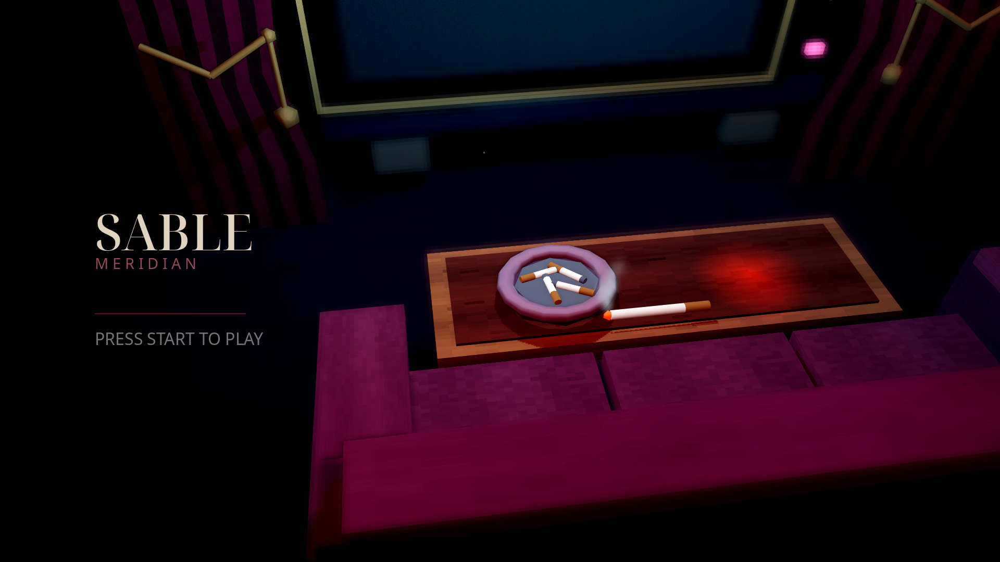

  

<h1 align="center">SABLE MERIDIAN</h1>

  <i>Dark fantasy teatral em 3D — um bobo sombrio atravessa um palco gótico de oito mundos.</i>

  
  
  
   
  
  
  
  
   
  

## Download

Baixe na aba **[Releases](../../releases)**:

* **Linux:** `SABLE-MERIDIAN-linux-x86_64.zip` — descompacte e rode `SABLE-MERIDIAN.x86_64`
* **Windows:** `SABLE-MERIDIAN-windows-x86_64.zip` — descompacte e rode `SABLE-MERIDIAN.exe`

## Sinopse

Sob holofotes de névoa, o **Veyl** — bobo de corte em traje carmesim — acorda num teatro em ruínas. A **Contrarregra** o aguarda no pátio: pegue o cajado, aprenda o compasso do combate e atravesse a névoa. Cada porta do hub abre um mundo com seu próprio boss; cada boss rende uma **chave** — e o primeiro, a **Lâmina do Eco**.

## Destaques

* Combate teatral: combos com launcher, ataques aéreos, esquiva com invulnerabilidade, **esquiva perfeita em câmera lenta** e ranking de estilo **D–S**.
* **6 armas jogáveis**, cada uma com skills **Q/E/R**: Cajado, Adagas de Cartas, Fios de Marionete, Bengala-Lâmina, Grimório Vivo e Lâmina do Eco (recompensa do mundo 01).
* Máscara do Riso (`Tab`), relíquia Bilhete do Bis, magias de cartas com mana e cooldown.
* Hub vertical com **8 mundos**, chaves persistentes e portais de retorno.
* Tela press-start cinematográfica, TV de título 3D interativa, HUD de vela com HP/MP, pausa e opções (presets LOW–ULTRA, modo sem bordas).
* Lock-on no alvo, saltos em parede com orbes colecionáveis e shaders próprios (névoa, CRT, água estilizada).

## Os oito mundos

| # | Mundo | Tema |
| --- | --- | --- |
| 01 | Coro Afundado | Ciclo completo: exploração → combate → boss → chave + Lâmina do Eco |
| 02 | Galeria dos Espelhos | Percurso aquático |
| 03 | Poço das Cordas | Travessia e combate |
| 04 | Nave Partida | Travessia e combate |
| 05 | Arquivo Suspenso | Travessia e combate |
| 06 | Ponte dos Ecos | Travessia e combate |
| 07 | Camarotes Vazios | Travessia e combate |
| 08 | Torre do Silêncio | Travessia e combate |

## Como jogar

1. Na tela **“PRESS START TO PLAY”**, pressione qualquer tecla.
2. No título, comece um **Novo jogo** (ou **Continue**, se já houver progresso).
3. No pátio, pegue o cajado no centro e atravesse a névoa sob o arco para chegar ao hub.
4. Entre nas portas, vença os bosses e colete as chaves.

## Controles

| Entrada | Ação |
| --- | --- |
| `WASD` | Mover |
| `Espaço` | Pular ou saltar da parede |
| `Shift` | Esquivar |
| Mouse esquerdo / direito | Ataques da arma equipada |
| Mouse do meio | Focar ou liberar alvo |
| `Q` / `E` / `R` | Skills da arma equipada |
| `1` / `2` / `3` | Cajado / Adagas de Cartas / Lâmina do Eco |
| `Tab` | Equipar ou retirar a Máscara do Riso |
| `F` | Interagir · avançar diálogo · entrar nas portas |
| Roda do mouse | Aproximar ou afastar câmera |
| `Esc` | Pausa |

## Novidades

* **Out/2026** — Tela press-start cinematográfica como abertura, hub com 8 mundos, kit visual graybox, shaders de água e céu, 6 armas com skills, grimório 3D e builds Linux + Windows.
* **Out/2026** — Combate com esquiva perfeita em câmera lenta, ranking de estilo D–S, lock-on, saltos em parede com orbes e HUD de vela com HP/MP.

> Esta página é atualizada a cada release, junto dos downloads jogáveis.

Licença: [MIT](LICENSE).

> Código-fonte não publicado. Este repositório contém apenas downloads jogáveis.
