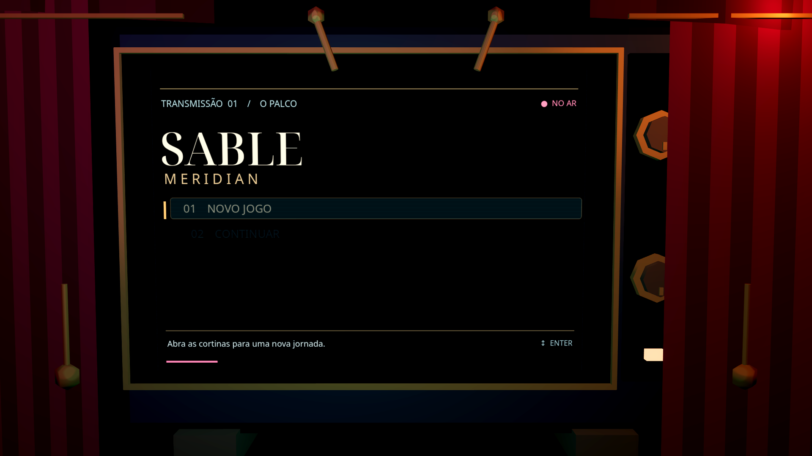
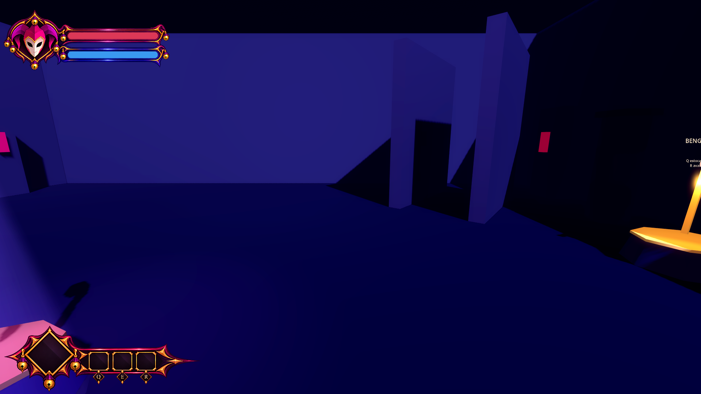
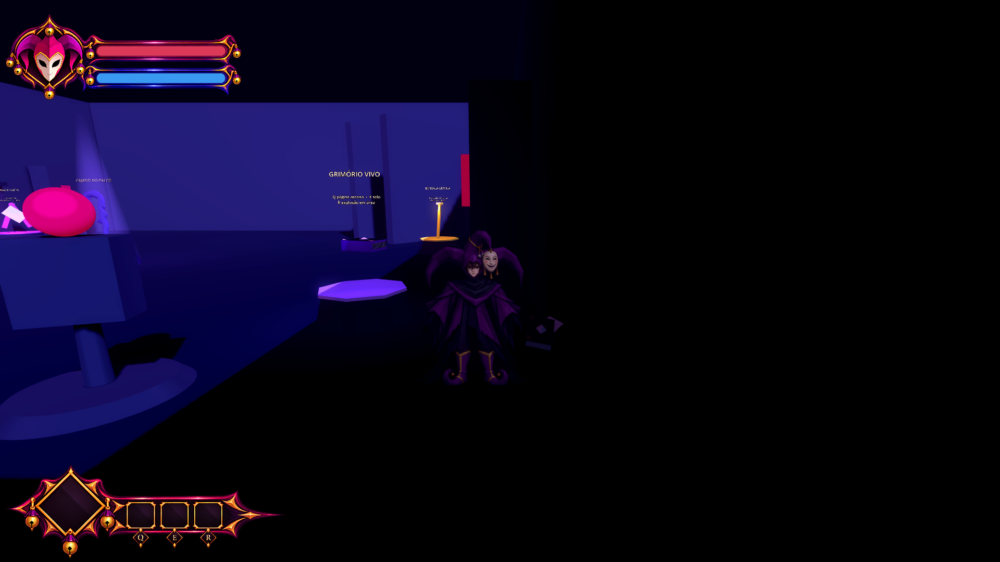
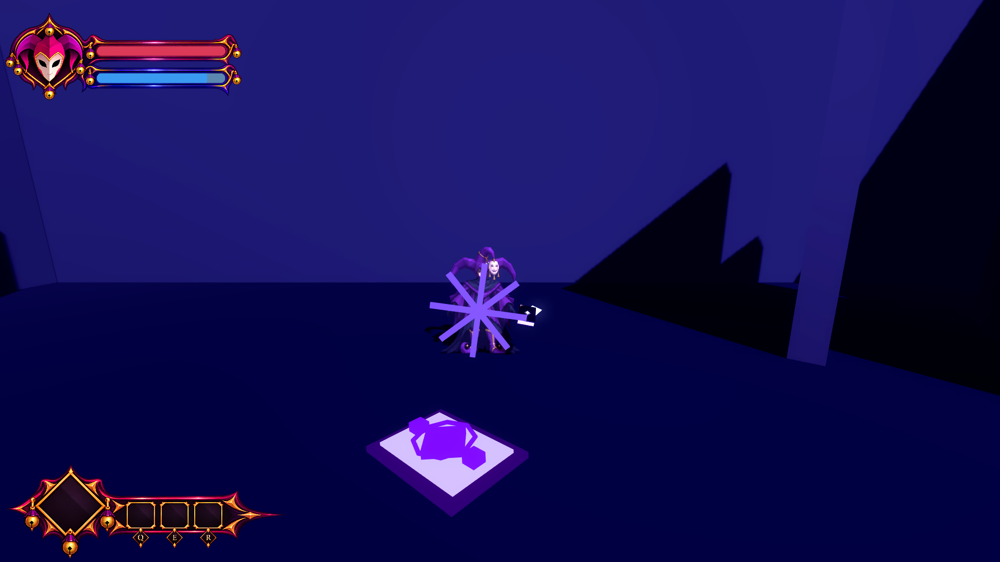
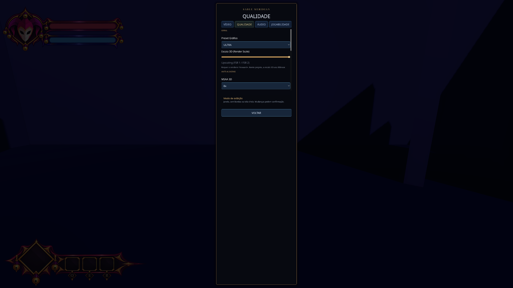

  

<h1 align="center">SABLE MERIDIAN</h1>

  <i>Protótipo de ação em terceira pessoa — dark fantasy teatral num palco de jester.</i>

  
  
  
  

Protótipo feito em **Godot 4.7 (GDScript, GL Compatibility, 1920×1080)**. O pátio de treino leva a uma cidade gótica em construção; o foco atual é movimento, combate e apresentação visual.

**Destaques**
- Combate com combos, esquiva perfeita em câmera lenta, ranking de estilo D–S e 5 armas com skills Q/E/R.
- Grimório Vivo em 3D, HUD de jester com HP/MP, TV de título 3D e tela de opções com presets e confirmação de tela.

## Galeria

| Pátio + HUD |
| --- |
|  |

| Grimório vivo 3D | Skill do grimório |
| --- | --- |
|  |  |

| Opções | Vídeo |
| --- | --- |
|  | [gameplay.mp4](docs/gameplay.mp4) (13 s, skills Q/E/R do grimório) |

## O que já funciona

- Combos de quatro golpes com launcher, ataques aéreos, esquiva com invulnerabilidade e esquiva perfeita com câmera lenta.
- Movimento e saltos em paredes, com limite ampliado por orbes coletadas; foco em alvos e ranking de estilo D–S.
- No pátio, o cajado e os expositores apresentam cinco armas jogáveis, cada uma com ataques básicos sem mana e skills Q/E/R. `1`/`2` selecionam Cajado e Adagas de Cartas; aproximar-se dos outros expositores equipa as demais armas. `Tab` ativa a regra da Máscara do Riso. O Bilhete do Bis recarrega o Baralho Maldito após uma esquiva perfeita.
- HUD de vida e mana com avisos contextuais, interação e diálogo com NPC, tela inicial em televisão 3D, pausa e opções persistentes de vídeo, áudio e câmera — incluindo tela de qualidade com presets LOW/MEDIUM/HIGH/ULTRA/CUSTOM, modo sem bordas, confirmação de 15 s para mudanças de tela e descrições contextuais.
- O **Grimório Vivo** agora é um modelo 3D (`assets/3d model/grimorio.glb`): aparece equipado ao lado do jogador e girando no pedestal do pátio.
- Ao entrar na fase, o mouse é capturado automaticamente para a câmera (clique recaptura se necessário).
- Passagem física com névoa entre o pátio e a cidade, iluminação toon e personagem em `AnimatedSprite3D` com oito direções de repouso e caminhada. O modelo 3D permanece oculto na apresentação atual.

Um adereço 3D junto ao sprite identifica a arma equipada; a máscara e a relíquia ainda não têm indicação no sprite/HUD. A troca de arma durante um golpe é aplicada na próxima janela do combo. Q/E/R consomem mana conforme a skill; Mouse1/Mouse2 não consomem.

O progresso salvo inclui as orbes de salto em parede. **Continuar** retorna ao pátio quando há orbes salvas; posição, combate e progresso de campanha não são salvos. **Novo jogo** limpa as orbes.

## Controles

| Entrada | Ação |
| --- | --- |
| `WASD` | Mover |
| `Espaço` | Pular ou saltar da parede |
| `Shift` | Esquivar |
| Mouse esquerdo / direito | Ataques básicos da arma equipada, sem custo de mana |
| Mouse do meio | Focar ou liberar alvo |
| `Q` / `E` / `R` | Skills da arma equipada |
| `1` / `2` | Cajado / Adagas de Cartas; outras armas nos expositores |
| `Tab` | Equipar ou retirar a Máscara do Riso |
| `F` | Interagir; revelar ou avançar diálogo |
| Roda do mouse | Aproximar ou afastar câmera |
| `Esc` | Pausa, voltar das opções ou encerrar diálogo |
| `F3` | Informações de depuração |

Na tela inicial, use mouse ou setas e `Enter` para selecionar. A lista de atalhos também aparece na tela inicial e na pausa.

## Executar

1. Abra esta pasta no **Godot 4.7.x** com o renderizador **GL Compatibility**.
2. Execute o projeto com `F5`. A cena inicial é `scenes/ui/title_screen.tscn`.
3. Inicie o jogo, colete o cajado no centro do pátio e atravesse a névoa sob o arco para chegar à cidade. O mouse é capturado ao entrar na fase; clique recaptura se preciso.

## Documentação

- [Arquitetura](docs/architecture.md) · [Equipamento](docs/equipment.md) · [Habilidades](docs/combat_abilities.md)
- [Contribuição](docs/contributing.md) · [Validação](docs/validation.md) · [Roadmap](docs/roadmap.md)

Licença: [MIT](LICENSE).
